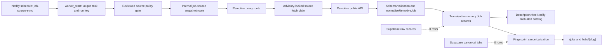

# SalaryPadi production truth audit

Observed at **2026-07-13 19:14 UTC**. This is a read-only production snapshot plus source-neutral observability code prepared locally. No production migration was applied, no source was activated, no production data was changed, no deployment was made, and no external message was sent.

The machine-readable evidence is [`reports/production-truth-audit.json`](../reports/production-truth-audit.json). Its schema and every visible-job provenance record are exercised by `src/lib/production-truth/audit.test.ts`.

## Outcome

**Production is serving a real but ephemeral Remotive catalog. Automation is executing, but historical source-run evidence is too coarse to answer every requested question retrospectively.**

- The public baseline is 38 visible jobs, 9 explicitly Nigeria-eligible remote jobs, 10 Africa-eligible remote jobs, 0 Nigeria-local jobs, 22 unclear-eligibility jobs, 17 feed-derived company profiles, and 0 publishable salary aggregates.
- Every one of the 38 visible jobs is attributable to a current Remotive URL. There are no durable raw-job records or canonical jobs in Supabase.
- The latest source worker recorded 39 normalized records; public fingerprint canonicalization rendered 38. Legacy evidence does not identify the removed duplicate.
- Remotive policy permits public listing and requires attribution, but prohibits full-description storage, indexing, `JobPosting` schema, and job-alert email distribution.
- All 15 registered workers have run. ATS execution is proven by 12 `skipped` ledger rows, but the ATS source gate is disabled, no ATS source is authorized/configured, and there has never been a successful ATS import.
- The latest jobs canary failed because it imposed a two-hour age limit on a source scheduled every 12 hours. The source was about 2.9 hours old and still within the reviewed 14-hour stale limit.
- Job, company, and salary routes are intentionally `noindex` under current source/privacy gates. The main sitemap contains 9 URLs and the tools sitemap contains 5. There are no job, company, or salary detail URLs in either sitemap.
- A missing/expired Remotive job currently becomes a `200 noindex` unavailable page, not a 404/410 tombstone.

## Baseline confirmation and corrections

| Baseline claim                   | Result                                             | Evidence                                                                                                                                                        |
| -------------------------------- | -------------------------------------------------- | --------------------------------------------------------------------------------------------------------------------------------------------------------------- |
| 38 jobs                          | Confirmed                                          | 38 unique `data-job-id` values across the rendered `/jobs` pagination.                                                                                          |
| 9 Nigeria-eligible remote jobs   | Confirmed                                          | Public Nigeria eligibility filter and the 38-row inventory both produce 9.                                                                                      |
| 0 local Nigeria jobs             | Confirmed                                          | `/jobs/nigeria` is empty; all current Remotive records normalize to remote.                                                                                     |
| One apparent source, Remotive    | Confirmed for visible jobs; corrected for registry | Every visible job says Remotive. The source registry has two active policies: Remotive and first-party employer submissions; the latter has no jobs or imports. |
| 17 thin company profiles         | Confirmed and clarified                            | 17 routes are synthesized from the current feed. `app.companies` and published company-rating evidence both contain 0 rows.                                     |
| No publishable salary aggregates | Confirmed                                          | Aggregate snapshots, publishable aggregate snapshots, and salary submissions are all 0.                                                                         |
| No indexed pages                 | Confirmed only as public-search evidence           | Exact-brand and `site:salarypadi.com` web queries returned no SalaryPadi pages. Search Console was not accessed, so this is not authoritative coverage data.    |

## Scheduler-to-public-page map



The scheduled worker warms the same policy-gated Next.js acquisition path used by public pages, then writes a description-free Blob catalog for internal alert/editorial consumers. Public pages do not read that Blob as their canonical store; they call `getLiveJobFeed`, which obtains the cached provider response, normalizes records, combines it with the empty database feed, and deduplicates by fingerprint.

For current Remotive jobs:

- **Raw record:** transient provider JSON only; it is not stored in `ingest.raw_job_records`.
- **Canonical job:** an in-memory `Job` object, deduplicated by fingerprint; it is not stored in `app.jobs`.
- **Public route:** the stable local slug and `remotive-{external_id}` both resolve while the record remains in the current provider snapshot.
- **Open reason:** presence in the latest accepted provider snapshot. Remotive supplies no expiry for these rows.
- **Last verified:** the source-response `Date` used as `lastCheckedAt`, shown as 13 July 2026 for all 38 current rows.
- **Legal/indexing state:** reviewed documented-public-API policy; listing and attribution allowed, but description persistence, indexing, `JobPosting`, and email use are denied.

The complete 38-row mapping of ID, slug, title, company, eligibility, source URL, and last-check label is in `current_job_provenance` in the machine artifact.

## Fourteen-day source report

The requested window begins 29 June, but production ledgers begin on 10 July. Therefore the evidence covers about four days, not 14 complete days.

### Remotive

- Runs: 15 total; 10 succeeded and 5 failed.
- Scheduled runs: 10; manual runs: 5.
- Fetch claims: 1 on 10 July, then 4 each on 11, 12, and 13 July.
- Successful fetched counts: 27, 27, 30, 30, 30, 41, 41, 39, 39, 39.
- All five failures recorded `remotive_http_error` and fetched 0.
- Accurate worker durations range from 1.306 to 10.552 seconds.
- Historical `ingest.import_runs` duration is falsely 0 because the legacy RPC inserted `started_at` and `completed_at` together.
- Historical `unchanged_count` was set equal to fetched count even though no durable canonical comparison occurred.
- Historical accepted, duplicate, rejected, Nigeria-local, explicit Nigeria/Africa eligibility, and unclear-eligibility counts were not captured. They are `null`, not zero, in the artifact.
- Durable new canonical jobs, updates, and closures are 0 because `app.jobs` is empty. Changes within the ephemeral public catalog were not historically measured.

The artifact's `source_run_report[0].runs` contains all 15 rows with run time, trigger, status, accurate duration, fetched, accepted, new canonical, updated, duplicates, rejected, closed, Nigeria-local, explicit eligibility, unclear eligibility, errors, and error code.

### SalaryPadi employer submissions

The source policy is active, but the audit window contains 0 import runs, 0 raw records, and 0 canonical jobs. This is a real zero, not an unavailable metric.

### Forward evidence added locally

The new `worker_record_source_import_v2` migration and job-source worker summary record:

- provider `source_checked_at` and real start/completion duration;
- fetched, accepted after fingerprint canonicalization, duplicates, rejected;
- new durable canonical jobs, updated, closed;
- Nigeria-local, explicitly Nigeria/Africa eligible, unclear eligibility, and errors.

Legacy rows remain untouched and unknown fields remain nullable. This code is not active in production until the migration and application are deployed through the normal release lane.

## Schedules, locks, retries, partial runs, limits, and alerts

Every configured Netlify schedule has corresponding database execution records:

| Worker                       | Cron UTC             | Runs | Failures | Latest terminal state | Last success UTC    |
| ---------------------------- | -------------------- | ---: | -------: | --------------------- | ------------------- |
| `afrotools_catalog_sync`     | `5 */6 * * *`        |   29 |        1 | succeeded             | 2026-07-13 18:05:48 |
| `alert_delivery`             | `*/10 * * * *`       |  467 |        2 | succeeded             | 2026-07-13 19:10:54 |
| `ats_source_sync`            | `35 2,8,14,20 * * *` |   12 |        0 | skipped (disabled)    | Never               |
| `currency_rates`             | `25 2 * * *`         |    4 |        0 | succeeded             | 2026-07-13 02:25:34 |
| `editorial_draft`            | `30 4 * * *`         |    3 |        0 | succeeded             | 2026-07-13 04:30:34 |
| `editorial_job_snapshot`     | `0 4 * * *`          |    6 |        3 | succeeded             | 2026-07-13 04:04:33 |
| `editorial_live_blocks`      | `10 */6 * * *`       |   12 |        1 | succeeded             | 2026-07-13 18:10:50 |
| `editorial_nightly_audit`    | `30 22 * * *`        |    4 |        1 | succeeded             | 2026-07-12 22:31:10 |
| `editorial_preflight`        | `0 5 * * *`          |    3 |        0 | succeeded             | 2026-07-13 05:10:30 |
| `editorial_publish`          | `0 8 * * *`          |    3 |        0 | succeeded             | 2026-07-13 08:02:48 |
| `editorial_queue`            | `0 6 * * *`          |    3 |        0 | succeeded             | 2026-07-13 06:12:23 |
| `editorial_topic_candidates` | `15 4 * * *`         |    3 |        0 | succeeded             | 2026-07-13 04:16:39 |
| `editorial_weekly_audit`     | `45 22 * * 0`        |    2 |        0 | succeeded             | 2026-07-12 22:47:50 |
| `job_source_sync`            | `5 1,13 * * *`       |   15 |        5 | succeeded             | 2026-07-13 13:07:23 |
| `operations_maintenance`     | `45 2 * * *`         |    4 |        0 | succeeded             | 2026-07-13 02:45:23 |

The exact last-start time, expected interval, stale interval, skips, and counts are in `schedules` in the artifact.

Locking and deadlines:

- A unique `(task_key, run_key)` insert makes scheduled worker starts idempotent. Duplicate schedule delivery returns 204 without running the operation.
- Scheduled functions reserve a 30-second platform window, 24 seconds for tracking, 20 seconds for the operation, 4 seconds for RPC cleanup, and 6 seconds as platform shutdown reserve.
- Remotive fetch claims use a transaction advisory lock, a one-minute minimum spacing rule, and four logical claims per rolling 24 hours. Claims are consumed before the outbound request and retained for 30 days.
- Remotive allows up to three HTTP attempts for transient transport errors, 408, 425, 429, and 5xx, with 250 ms then 500 ms delay. It does not honor `Retry-After`. Because the claim wraps a logical fetch rather than each adapter attempt, four claims can produce up to 12 provider HTTP attempts in 24 hours. This is an open rate-accounting limitation.
- Remotive response size is capped at 2 MiB; provider/proxy requests are bounded by 10 seconds, the internal snapshot request by 15 seconds, and cached snapshots are rejected after 14 hours or more than 5 minutes in the future.
- Remotive is all-or-nothing. Invalid shape, empty response, normalization failure, catalog-count mismatch, or policy mismatch fails the run and does not replace the prior Blob catalog.
- ATS is capped at one source per run, 400 provider records, 200 records/1 MiB per batch, and an 8-second source fetch. Per-source advisory locks enforce configured cadence, minimum spacing, and daily budget.
- ATS partial/quarantined/failed snapshots are sealed but never reconcile closures. A job is expired only after two independently successful complete snapshots omit it. A running snapshot younger than one hour blocks another; an older one is recovered as failed.

Alerts and monitors:

- Existing durable alerts cover editorial workers only. At observation time five were open: three stale editorial job-snapshot alerts, one live-block RPC alert, and one nightly-audit RPC alert.
- Historical `job_source_sync` failures created worker/import ledger rows and function logs but no durable operational alert.
- The local migration extends `worker_finish` to create critical durable alerts for source workers, warning alerts for other non-editorial workers, and resolve open alerts after a later success. It sends no external message.
- GitHub's jobs canary is configured for 01:20 and 13:20 UTC. Its latest run, `29264606526`, failed solely on the inconsistent two-hour freshness assertion (10,446,223 ms observed versus 7,200,000 ms required). The local test now uses the reviewed 14-hour stale boundary.
- The separate production-freshness workflow is configured for 03:43, 09:43, 15:43, and 21:43 UTC. It had no execution record yet because it was added after the last due time and the next scheduled time had not arrived. It is configured, not execution-proven.

## Crawlability and public-route audit

| Route/evidence                          | HTTP | Robots/canonical/schema result                                                                                   |
| --------------------------------------- | ---: | ---------------------------------------------------------------------------------------------------------------- |
| `/`                                     |  200 | Indexable; self canonical; Organization schema.                                                                  |
| `/robots.txt`                           |  200 | Allows public content; blocks API/account/admin/auth/private contribution paths; advertises both valid sitemaps. |
| `/sitemap.xml`                          |  200 | 9 URLs: core trust pages, one guide, insights hub, and one published insight.                                    |
| `/tools/sitemap.xml`                    |  200 | 5 URLs: tools hub plus four tools.                                                                               |
| `/jobs`                                 |  200 | `noindex,follow`; self canonical; Organization schema only.                                                      |
| `/jobs/remote`                          |  200 | `noindex,follow`; self canonical.                                                                                |
| `/jobs/nigeria`                         |  200 | `noindex,follow`; self canonical; empty real state.                                                              |
| Coalition job detail                    |  200 | `noindex,follow`; self canonical; Organization + Breadcrumb; no `JobPosting`.                                    |
| Missing job detail                      |  200 | `noindex`; no canonical; rendered unavailable state (soft 404).                                                  |
| `/companies` and current company detail |  200 | `noindex,follow`; company detail has canonical + Breadcrumb.                                                     |
| `/salaries` and an empty salary detail  |  200 | `noindex,follow`; threshold-gated, no publishable aggregates.                                                    |
| `/insights` and published insight       |  200 | Indexable; canonical; published detail includes Article schema.                                                  |
| `/guides/remote-jobs-open-to-nigerians` |  200 | Indexable; canonical; Article schema.                                                                            |
| `/feed.xml`                             |  200 | RSS response.                                                                                                    |

Current policy behavior is internally consistent: crawlers may reach job pages to see `noindex`, but Remotive jobs are excluded from the sitemap and `JobPosting` output. The defect is lifecycle status: when a provider record disappears there is no durable last-seen/closed evidence or tombstone. The streamed route commits HTTP 200 before `notFound`, so a missing job remains a noindex soft 404.

## Coalition Technologies defect reproduction

Production displays the Coalition Remote Office Assistant salary as `$31,2k- $52k`, with pay period unknown. The description states `$15 to $25 per hour` and requires availability from `9:00 a.m. to 6:00 p.m. Pacific Time`.

The deterministic test reproduces both defects:

```powershell
npx vitest run src/lib/production-truth/audit.test.ts
```

Observed salary parsing:

- `parseAmount` removes every comma, so `31,2k` becomes `312k`.
- The parser then sorts the bounds to USD 52,000–312,000 with unknown pay period.
- Under the documented comparison assumption of 40 hours/week × 52 weeks, the description implies USD 31,200–52,000 annually.

Observed time-zone parsing:

- Eligibility reads `candidate_required_location` (`Worldwide`) only.
- `classifyEligibilityEvidence` always initializes `requiredTimezone` to `null`.
- The Pacific-time requirement in the description is therefore omitted.

The follow-on job-supply implementation corrected both defects locally while retaining the original production observations in the machine artifact as reproduction evidence. Decimal-comma parsing now returns 31,200–52,000 with unknown source period, and description evidence now preserves the Pacific Time requirement. Neither correction has been deployed and neither rewrites production data.

## Hosting, deployment, logs, and environment

- Production site ID: `f20afc4c-5326-4f00-97bf-570a679aadbc`.
- Latest production deploy: `6a552080f4ce3f0008fcfa84`, ready, branch `main`, commit `29dd7364cf695c015ccb1fe737822765ca9d910b`, published at 17:30:49 UTC.
- The exact commit's GitHub CI run `29270642064` succeeded.
- Two earlier production deploys in the inspected history failed; the current ready deploy supersedes them.
- Supabase API/Postgres log tools expose only the last 24 hours. Netlify function-log inspection returned fewer historical events than the database ledger. Consequently, worker/import tables are the source of truth for execution counts; logs are corroborating evidence only.
- The public `/api/health` returned 200 and all 15 worker rows. Its expected-worker contract omitted ATS even though the live row happened to be present; the local fix makes ATS mandatory.

Configured environment-variable names (values were never printed):

`AFROTOOLS_API_BASE_URL`, `AFROTOOLS_API_KEY`, `ALLOW_DEMO_DATA`, `ANALYTICS_PROVIDER`, `ATS_SOURCE_SYNC_ENABLED`, `CURRENCY_RATE_PROVIDER`, `EDITORIAL_AUTOMATION_ENABLED`, `EMAIL_PROVIDER`, `JOB_SOURCE_SYNC_TOKEN`, `NEXT_PUBLIC_APP_URL`, `NEXT_PUBLIC_GOOGLE_ANALYTICS_ID`, `NEXT_PUBLIC_SUPABASE_PUBLISHABLE_KEY`, `NEXT_PUBLIC_SUPABASE_URL`, `NODE_VERSION`, `REMOTIVE_SOURCE_ENABLED`, `RESEND_API_KEY`, `SALARYPADI_API_KEY`, `SUPABASE_SERVICE_ROLE_KEY`, `TRANSACTIONAL_EMAIL_FROM`, `TRANSACTIONAL_EMAIL_REPLY_TO`.

Verified gates: `ATS_SOURCE_SYNC_ENABLED=false`, `REMOTIVE_SOURCE_ENABLED=true`, `ALLOW_DEMO_DATA=false`, and required production names are present. These statements compare presence/boolean state only; no value is included in this audit.

## Observability changes prepared locally

1. Extended forward import evidence with real duration, snapshot time, accepted/deduplicated/rejected/eligibility counts.
2. Extended durable alerts to non-editorial workers without external delivery.
3. Added an AAL2-admin-only `GET /api/internal/production-health` endpoint with `no-store` and a validated DTO that excludes secrets, descriptions, contact data, and alert summaries.
4. Added `/admin/source-health` for source policy, 14-day run evidence, worker freshness, and open alert codes.
5. Added ATS to the public health route's required-worker contract.
6. Aligned the jobs canary freshness assertion with the reviewed 14-hour stale boundary.
7. Added the machine artifact and tests that account for all 38 visible jobs and reproduce the Coalition defects.

These changes are source-semantics-neutral and remain unapplied/undeployed.

## Known defects and unknowns

- Historical accepted/deduplicated/rejected/eligibility run counts cannot be reconstructed from existing ledgers.
- The identity of the 39th latest worker-snapshot record removed by public fingerprint canonicalization is not recoverable from public pages or legacy run evidence.
- No full 14-day history exists because production ledgers began on 10 July.
- No Search Console coverage proof was available.
- Production-freshness workflow execution remains scheduled-proof-pending.
- Missing/expired Remotive detail pages are soft 404s and lack durable lifecycle evidence.
- Coalition salary and Pacific-time parsing defects are open.
- Remotive claim budgeting counts logical sessions, not individual retry attempts, and does not honor `Retry-After`.
- The new source metrics, alert coverage, admin dashboard, and internal endpoint are not production facts until migrated and deployed.

## Commands used

Read-only production/repository evidence included:

```powershell
git status --short --branch
git log -1 --format='%H%n%cI%n%s'
rg --files
rg -n "schedule:|worker_start|worker_finish|source_fetch_claims|retry|sitemap|robots" ...
gh run list --workflow jobs-live-smoke.yml
gh run view 29264606526 --log-failed
gh run list --workflow production-freshness.yml
netlify watch
netlify api getSite --data ...
netlify api listSiteDeploys --data ...
netlify logs --function job-source-sync ats-source-sync --since 14d --json
```

The configured `supabase_salarypadi` MCP target was used for project URL verification, schema/migration inspection, safe aggregate SQL, and 24-hour log inspection. Queries selected counts, statuses, timings, policy flags, and non-personal error codes only.

Public checks used bounded GETs against:

```text
https://salarypadi.com/api/health
https://salarypadi.com/robots.txt
https://salarypadi.com/sitemap.xml
https://salarypadi.com/tools/sitemap.xml
https://salarypadi.com/jobs
https://salarypadi.com/jobs/remote
https://salarypadi.com/jobs/nigeria
https://salarypadi.com/companies
https://salarypadi.com/salaries
https://salarypadi.com/insights
https://salarypadi.com/feed.xml
```

Validation completed:

```powershell
npm run lint
npm run typecheck
npm test
npm run audit:production-truth
NEXT_PUBLIC_APP_URL="https://salarypadi.test" npm run quality
npm run ops:verify-freshness -- --json
PLAYWRIGHT_BASE_URL="https://salarypadi.com" REQUIRE_LIVE_SOURCE="true" npx playwright test tests/e2e/live-jobs.spec.ts --project=desktop-chromium
git diff --check
```

Results: lint and typecheck passed; 92 Vitest files / 713 tests passed; the audit test's 5 checks passed; the Next.js production build compiled and generated 86 pages; the live freshness verifier passed all 15 workers and four public routes; and the live jobs canary passed in Chromium.
